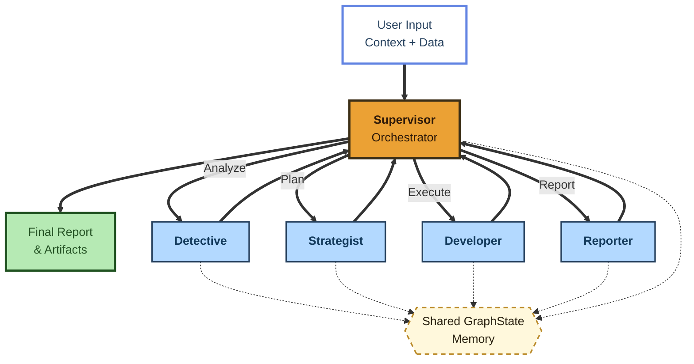

# NeoVibe Solver: ML & BA multiagent system for solving business problems

## Installation Guide

### Get API keys

1. Get keys from [Anthropic API](https://console.anthropic.com/) (for LLM) and [E2B API](https://e2b.dev/dashboard?tab=keys) (for Python code execution, free version is enough).

### a) Running on Hugging Face Spaces

1. Open a website via [link](https://huggingface.co/spaces/nektonekks/NeoVibeSolver)

2. Duplicate the space and add your API keys into the corresponded fields

3. Add data and prompts and click `Run pipeline` (samples of data with templates of prompts are included in `\test_data` directory)

### b) Running locally

1. **Install `uv` package**\
   [Installation guide](https://docs.astral.sh/uv/getting-started/installation/)

2. **Create and activate a virtual environment**

    ```bash
    uv venv .venv
    .venv\Scripts\activate
    ```

3. **Install dependencies**

    ```bash
    uv sync
    ```

4. Add the file `.env` in the root of the directory with your API keys:
    ```
    ANTHROPIC_API_KEY=sk-ant...
    E2B_API_KEY=e2b_...
    ```

5. Run in the terminal:
    ```bash
    task demoweb
    ```

6. Add data and prompts and click `Run pipeline` (samples of data with templates of prompts are included in `\test_data` directory)

7. Output data will be added to the `\outputs` directory


## Architecture Overview

### 1. High-Level Concept
**NeoVibe Solver** is a specialized Multi-Agent System designed to automate Business Intelligence (BI), Data Analysis and Machine Learning tasks. It leverages a stateful graph architecture to orchestrate autonomous AI agents that collaborate to transform raw datasets and business questions into actionable strategic reports and code solutions.

The system acts as an **autonomous data scientists team**, capable of understanding business context, profiling data, formulating analytical strategies, generating executable Python code, and synthesizing final reports.

### 2. System Architecture

The core architecture follows a **Centralized Supervisor Pattern (Hub-and-Spoke)** implemented via **LangGraph**.



#### 2.1. The Orchestration Layer (The Graph)
The workflow is not linear but dynamic. A central **Supervisor** node acts as the router and state manager. It decides which specialist agent should act next based on the current state of the investigation and the user's initial request.

* **Topology:** Cyclic Graph (State Machine)
* **State Management:** A shared `GraphState` object persists context across all agent interactions.
* **Termination:** The process concludes when the Supervisor determines the task is complete and routes to the `end` node.

#### 2.2. The Shared State (`GraphState`)
The system maintains a strictly typed shared memory structure that all agents read from and write to. This ensures context consistency throughout the lifecycle.

* **`user_input`**: Stores the raw business context, specific task definition, and file paths.
* **`messages`**: A chronological history of agent-to-agent and agent-to-user communication.
* **`data_profile`**: Metadata and statistical summary of the uploaded datasets (generated by the Detective).
* **`plan`**: The strategic roadmap of analysis steps (generated by the Strategist).
* **`code_context`**: Generated Python snippets and execution results.
* **`final_report`**: The synthesized output in Markdown format.

### 3. Core Components (The Agents)

The system consists of five specialized agents, each powered by a Anthropic LLMs with distinct system prompts and responsibilities:

1.  **Supervisor (Orchestrator)**
    * **Role:** Team Lead / Project Manager.
    * **Function:** Analyzes the current state and decides the next step. It does not perform analysis itself but delegates tasks to other agents. It ensures the process adheres to the logical flow: *Understand Data -> Plan -> Execute -> Report*.

2.  **Detective (Data Analyst)**
    * **Role:** Data Profiler.
    * **Function:** Reads the raw `.csv`/`.xlsx`/`.xls`/`.json`/`.parquet`/`.pdf`/`.zip`/`.txt`/`.md` files. Its primary goal is to understand the schema, data types, missing values, and semantic meaning of columns to populate the `data_profile`.

3.  **Strategist (Planner)**
    * **Role:** Lead Data Scientist.
    * **Function:** Considers the `business_context` and the `data_profile` to create a step-by-step analytical plan. It determines *how* to solve the user's problem using the available data (e.g., "Perform RFM analysis," "Train a regression model").

4.  **Developer (Engineer)**
    * **Role:** Python Developer.
    * **Function:** Translates the Strategist's plan into executable Python code. *Note: In this architecture, the Developer focuses on code generation.*

5.  **Reporter (Technical Writer)**
    * **Role:** Business Analyst.
    * **Function:** Synthesizes all findings, code outputs, and insights into a coherent, business-oriented Markdown report.
